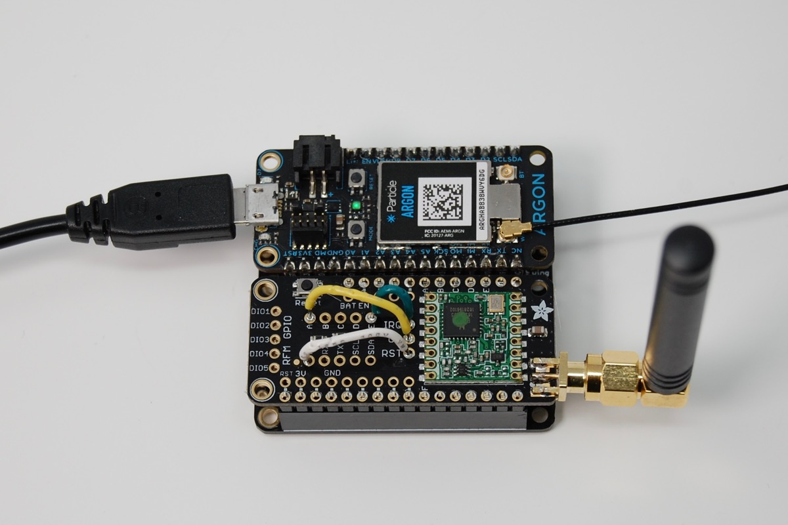
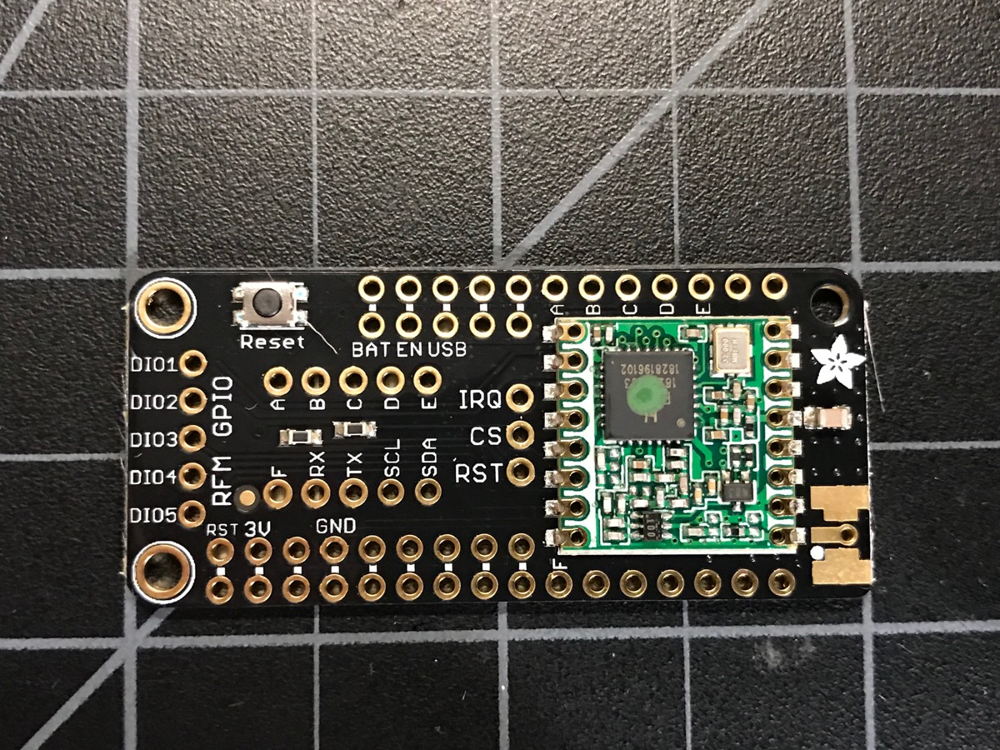
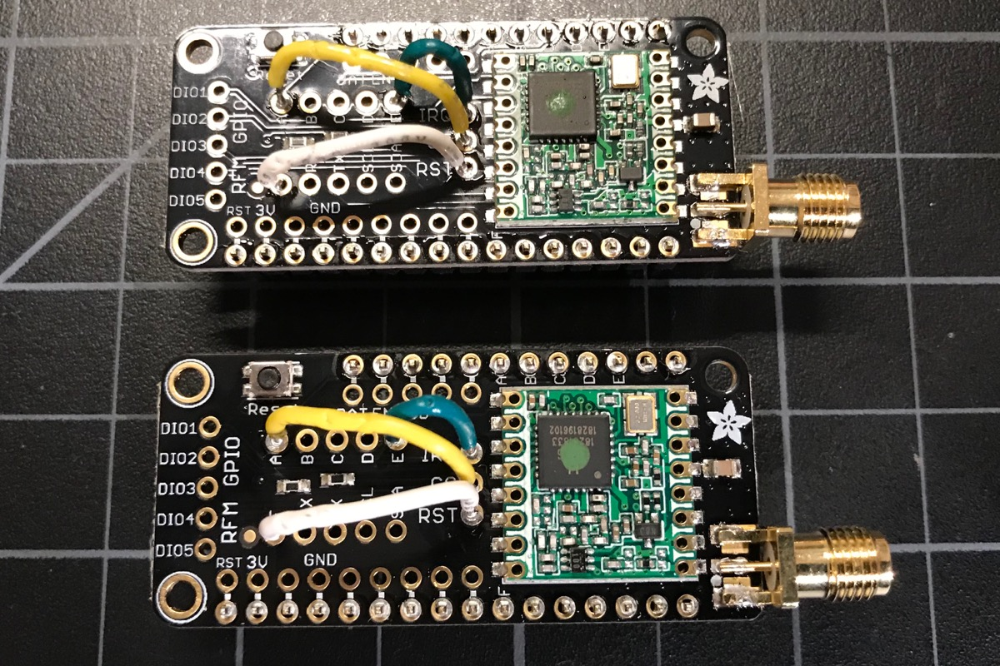
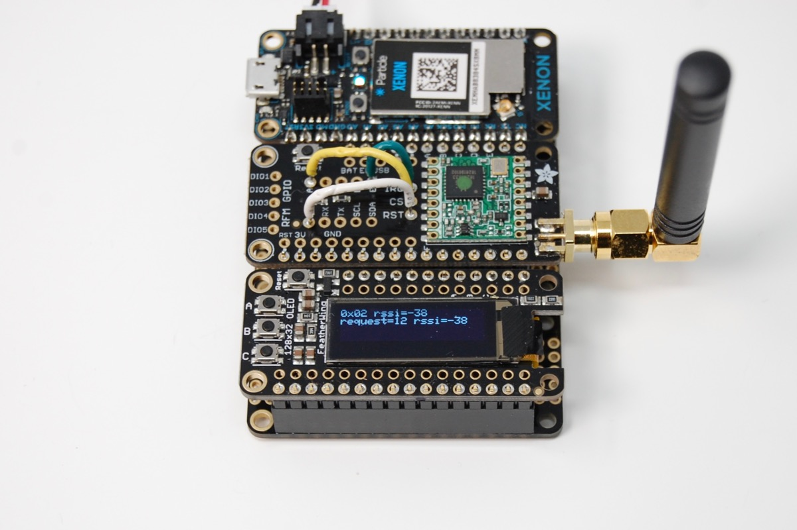

# RF9X-RK

*Port of the RadioHead RF95/96/97/98 LoRa Packet radio driver for Particle*

This is a port of the [RadioHead Packet Radio Library](http://www.airspayce.com/mikem/arduino/RadioHead/) version 1.89 for RF95/96/97/98 LoRa compatible radios.



Note that this only allows nearby RF9x LoRa radios to communicate with each other in point-to-point mode to send data packets. It does not allow the Xenon, for example, to establish a cloud connection over LoRa instead of Particle Mesh (Thread mesh, 6LoWPAN over 802.15.4).

While I tested the Adafruit FeatherWing form-factor radios, it also works with the breakout versions.

- [RFM95W](https://www.adafruit.com/product/3231) 868 or 915 MHz  Americas ITU 2 license-free ISM
- [RFM98](https://www.adafruit.com/product/3232) 433 MHz for use in Europe ITU 1 license-free ISM

Don't forget to purchase an antenna to go with your radio! 

## Assembly

If you are using the Adafruit Radio FeatherWing you should [just follow the Adafruit instructions](https://learn.adafruit.com/radio-featherwing/overview).



The radio communicates by SPI (MISO, MOSI, and SCK) and these pins are fixed. 

However, there is a choice you need to make for the 3 remaining control pins. I selected these pins:

| Pin | Map To | Particle Pin | Color |
| --- | --- | --- | --- |
| IRQ | E | D2 | Green |
| CS | A | D6 | Yellow |
| RST | F | A5 | White |

The reason is that D3, D4, and D5 (D, C, B) are used by the Ethernet FeatherWing, and by using different pins you can put the Radio FeatherWing in the Particle Ethernet FeatherWing along with a Xenon to make a nice base station.

After soldering the headers and the jumper wires are shown above:




## Library Notes

I included what I believe to be a useful subset of the RadioHead library features:

- RF95/96/97/98 radio support
- Reliable datagram
- Encryption (optional)

You can easily make a fork of this library and add in a different set of features copied from the RadioHead distribution easily, if you wanted to.


## Examples

### Reliable Datagram

The reliable datagram client and server projects set up point-to-point communications between two radios. Note that you must assure:

- The models are the same (RF95X to RF95X, for example)
- The frequency is configured to be the same
- You have correctly configured the addresses (0-254) on both sides.

If you flash the server code to a device and monitor the USB serial output, you'll see something like this:

```
got packet from 0x01 rssi=-5 to server counter=1
got packet from 0x01 rssi=-4 to server counter=2
got packet from 0x01 rssi=-5 to server counter=3
got packet from 0x01 rssi=-5 to server counter=4
got packet from 0x01 rssi=-5 to server counter=5
```

And from the client:

```
Sending to rf95_reliable_datagram_server
got reply from 0x02 rssi=-3 request=1 rssi=-5
Sending to rf95_reliable_datagram_server
got reply from 0x02 rssi=-4 request=2 rssi=-4
Sending to rf95_reliable_datagram_server
got reply from 0x02 rssi=-3 request=3 rssi=-5
Sending to rf95_reliable_datagram_server
got reply from 0x02 rssi=-4 request=4 rssi=-5
```


### Encrypted

The encrypted version uses the [rweather CryptoLW library](https://github.com/rweather/arduinolibs) ported to the Particle platform as [CryptoLW-RK](https://github.com/rickkas7/CryptoLW-RK).

Note that you must assure:

- The models are the same (RF95X to RF95X, for example)
- The frequency is configured to be the same
- You have the same encryption key configured in the server and client


### Display Example

In the more-examples/10-reliable-datagram-client-display directory, there's a sample program that's almost the same as 4-reliable-datagram-client, except it displays the output on the [Adafruit OLED FeatherWing](https://www.adafruit.com/product/2900).




### Licensing Note

While most of my libraries are MIT or Apache Licensed, this one is GPL Version 2, because the original RadioHead library was. Thus there are limitations on using it in closed-source commercial projects!

> This software is Copyright (C) 2008 Mike McCauley. Use is subject to license
conditions. The main licensing options available are GPL V2 or Commercial:

> Open Source Licensing GPL V2

> This is the appropriate option if you want to share the source code of your
application with everyone you distribute it to, and you also want to give them
the right to share who uses it. If you wish to use this software under Open
Source Licensing, you must contribute all your source code to the open source
community in accordance with the GPL Version 2 when your application is
distributed. See http://www.gnu.org/copyleft/gpl.html

> Commercial Licensing

> This is the appropriate option if you are creating proprietary applications
and you are not prepared to distribute and share the source code of your
application. Contact info@open.com.au for details.


